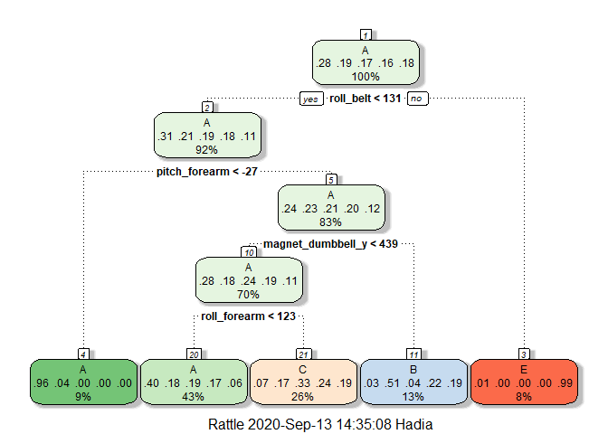
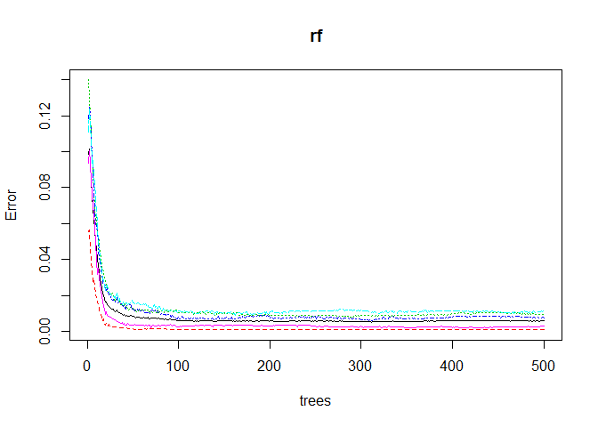

## Backgroud
This project is aimed to predict the manner in which the people exercise. The dataset is acquired from the 'Weightlifting Exercise Dataset' from http://web.archive.org/web/20161224072740/http:/groupware.les.inf.puc-rio.br/har . The weightlifting techniques are categorized in five clasees as specified by "classe" variable, these categories are
 *  A: exactly according to the specification. 
 *  B: Clasthrowing the elbows to the front.
 *  C: Lifting the dumbbell only halfway.
 *  D: lowering the dumbbell only halfway. 
 *  E: and throwing the hips to the front.

Class 'A' corresponds to the specified execution of the exercise, whereas the other four classes correspond to common mistakes. The goal of this project is to predict how pepople in the "test" group would exercise (Class A-E).

## 1. Data dowload and cleaning
Install the libraries needed for this analysis

```
## Warning: package 'dplyr' was built under R version 3.6.3
```

```
## 
## Attaching package: 'dplyr'
```

```
## The following objects are masked from 'package:stats':
## 
##     filter, lag
```

```
## The following objects are masked from 'package:base':
## 
##     intersect, setdiff, setequal, union
```

```
## Warning: package 'caret' was built under R version 3.6.3
```

```
## Loading required package: lattice
```

```
## Loading required package: ggplot2
```

```
## 
## Attaching package: 'caret'
```

```
## The following object is masked from 'package:purrr':
## 
##     lift
```

Download data from the source.

```r
traindata <- read.csv(url("https://d396qusza40orc.cloudfront.net/predmachlearn/pml-training.csv"),header=TRUE)
testdata <- read.csv(url("https://d396qusza40orc.cloudfront.net/predmachlearn/pml-testing.csv"),header=TRUE)
```
The first seven coloumns contain information that is not useful for our model. Remove first seven coloumns. Additionally, there are many varibales with many empty slots; remove the variables that have 30% or more empty slots.

We will keep the testdata for validation and build and test the model on traindata.

## 2. Building Model
Split train data into testing and training data using "classe" variable

```r
Index <- createDataPartition(train$classe, p = 0.7, list = FALSE)
training <- train[Index,]
testing <- train[-Index,]
```

We will build 3 models using different ML algorithms and use the best model for prediction.

### 2.1. Cart (Classification and Regression Treess)

```r
#Build a model using training data
cart <- train( classe ~ .,data=training,  method='rpart')
#Predict
cart_predict <- predict(cart, testing)
#Extract confusion matrix and the accuracy of the model when tested with #the test set
cart_cm<- confusionMatrix(cart_predict, testing$classe)
cart_acc<- cart_cm[["overall"]][["Accuracy"]]*100
cart_acc
```

```
## [1] 49.26083
```
Use rattle library to plot the decision tree of the final model.

```r
library(rattle)
```

```
## Warning: package 'rattle' was built under R version 3.6.3
```

```
## Loading required package: tibble
```

```
## Warning: package 'tibble' was built under R version 3.6.3
```

```
## Loading required package: bitops
```

```
## Rattle: A free graphical interface for data science with R.
## Version 5.4.0 Copyright (c) 2006-2020 Togaware Pty Ltd.
## Type 'rattle()' to shake, rattle, and roll your data.
```

```r
fancyRpartPlot(cart$finalModel)
```

<!-- -->

### 2.2. Gbm Model 

```r
#Build a model using training data
set.seed(123)
controlGBM <- trainControl(method = "repeatedcv", number = 5, repeats=1)
gbm <- train( classe ~ .,data=training,  method='gbm', 
              trControl = controlGBM, verbose=FALSE)

gbm
```

```
## Stochastic Gradient Boosting 
## 
## 13737 samples
##    52 predictor
##     5 classes: 'A', 'B', 'C', 'D', 'E' 
## 
## No pre-processing
## Resampling: Cross-Validated (5 fold, repeated 1 times) 
## Summary of sample sizes: 10990, 10990, 10988, 10990, 10990 
## Resampling results across tuning parameters:
## 
##   interaction.depth  n.trees  Accuracy   Kappa    
##   1                   50      0.7556954  0.6903591
##   1                  100      0.8213583  0.7739070
##   1                  150      0.8521504  0.8129302
##   2                   50      0.8569541  0.8188094
##   2                  100      0.9039814  0.8784894
##   2                  150      0.9288780  0.9100030
##   3                   50      0.8967015  0.8692343
##   3                  100      0.9397978  0.9238186
##   3                  150      0.9586515  0.9476851
## 
## Tuning parameter 'shrinkage' was held constant at a value of 0.1
## 
## Tuning parameter 'n.minobsinnode' was held constant at a value of 10
## Accuracy was used to select the optimal model using the largest value.
## The final values used for the model were n.trees = 150, interaction.depth =
##  3, shrinkage = 0.1 and n.minobsinnode = 10.
```

```r
#Predict
gbm_predict <- predict(gbm, testing)
#Extract confusion matrix and the accuracy of the model when tested with #the test set
gbm_cm<- confusionMatrix(gbm_predict, testing$classe)
gbmacc<- gbm_cm[["overall"]][["Accuracy"]]*100
gbmacc
```

```
## [1] 95.61597
```

### 2.3. Random Forest Model

```r
library(randomForest)
```

```
## randomForest 4.6-14
```

```
## Type rfNews() to see new features/changes/bug fixes.
```

```
## 
## Attaching package: 'randomForest'
```

```
## The following object is masked from 'package:rattle':
## 
##     importance
```

```
## The following object is masked from 'package:ggplot2':
## 
##     margin
```

```
## The following object is masked from 'package:dplyr':
## 
##     combine
```

```r
#Build a model using training data
rf <- randomForest(classe ~., data=training); rf
```

```
## 
## Call:
##  randomForest(formula = classe ~ ., data = training) 
##                Type of random forest: classification
##                      Number of trees: 500
## No. of variables tried at each split: 7
## 
##         OOB estimate of  error rate: 0.58%
## Confusion matrix:
##      A    B    C    D    E class.error
## A 3902    3    0    1    0 0.001024066
## B   16 2633    9    0    0 0.009405568
## C    0   18 2378    0    0 0.007512521
## D    0    0   24 2227    1 0.011101243
## E    0    0    2    5 2518 0.002772277
```

```r
#Plot the results of model
plot(rf)
```

<!-- -->


```r
#The plot shows that error rate decreases when number of trees increases until about 20-50 trees, after that the error rate is pretty constant. So we use number of trees in teh forest to be 50.
rf <- randomForest(classe ~., data=training, ntree=50)

#Predict
rf_predict <- predict(rf, testing)

#Extract confusion matrix and the accuracy of the model when tested with #the test set
rf_cm<- confusionMatrix(rf_predict, testing$classe)
rfacc<- rf_cm[["overall"]][["Accuracy"]] *100
rfacc
```

```
## [1] 99.37128
```

Combine the accuracy results into a table

```r
t<- data.frame()
t<- cbind(gbmacc, cart_acc, rfacc)
t
```

```
##        gbmacc cart_acc    rfacc
## [1,] 95.61597 49.26083 99.37128
```
The results how that random forest has the highest accuracy so we will use random forest to make final prediction. 

## 3. Predicting on the test set.
We can predict the outcome (How a person in each case is predicted to perform). Outcome of each case would be A,B,C,D or E depending upon the prediction. As random forest model has the best accuracy , we use rf to predict the outcome of our test cases.

```r
rf_final <- predict(rf, test)
rf_final
```

```
##  1  2  3  4  5  6  7  8  9 10 11 12 13 14 15 16 17 18 19 20 
##  B  A  B  A  A  E  D  B  A  A  B  C  B  A  E  E  A  B  B  B 
## Levels: A B C D E
```

### Out of Sample Error
Out of sample error is estimated as 1 - accuracy for predictions for cross-validation set. 
So out of sample error for the final model is 1- 0.992 = 0.0078

### Cross Validation
I used random forest model for my predictive mode. As random forest uses multiple bagging methods which prevents over fitting. there is no need to cross validate.
